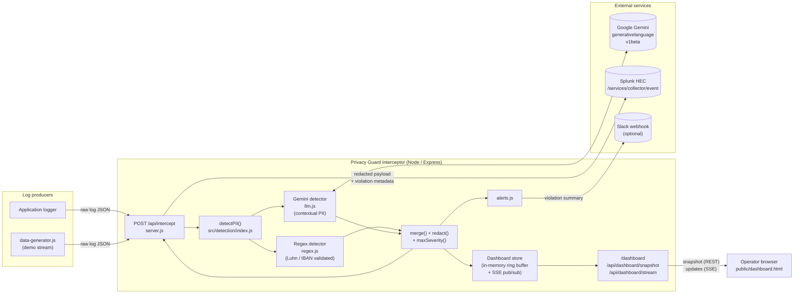

# Architecture

Privacy Guard Interceptor sits between application log producers and Splunk,
scrubbing personally identifiable information (PII) and secrets before any
sensitive value reaches the indexer. The same intercept produces a real-time
compliance view and (optionally) a webhook alert.

## System diagram

## Data flow

1. **Ingest** — A producer (real application logger or `data-generator.js`)
   POSTs a structured log to `POST /api/intercept`:
   `{ time, event: { level, message } }`.
2. **Hybrid detection** — `detectPII()` runs two detectors concurrently:
   - **Regex** (`src/detection/regex.js`): cheap, deterministic patterns for
     credit cards (Luhn-validated), IBANs (mod-97 validated), SSNs, JWTs,
     private-key headers, AWS / GitHub / Google / Stripe / Slack tokens, and
     emails.
   - **Gemini LLM** (`src/detection/llm.js`): catches contextual PII regex
     cannot see — names, addresses, free-text passwords, DOBs, medical
     record context. Uses `gemini-2.5-flash` with `response_mime_type:
     application/json` and a strict system prompt; LLM-reported substrings
     are verified against the original message before being trusted.
3. **Merge & redact** — `merge.js` keeps regex hits authoritative and adds
   LLM findings only where they do not overlap. `redact.js` rewrites the
   message with `[REDACTED_<CATEGORY>]` markers, in reverse position order
   so earlier offsets remain valid.
4. **Severity** — `severity.js` ranks each category
   (`critical > high > medium > low > none`) and the worst finding sets the
   record's overall severity.
5. **Forward to Splunk** — `splunk.js` ships the **redacted** payload to
   Splunk HEC, plus structured violation metadata
   (`violation_flag`, `violation_severity`, `violation_categories`,
   `violation_sources`, `detection_ms_regex`, `detection_ms_llm`,
   `ai_audited`, `ai_error`). TLS verification is opt-in via
   `SPLUNK_INSECURE_TLS=true` and scoped to the Splunk request only —
   never globally.
6. **Live dashboard** — Every intercept is recorded in an in-memory ring
   buffer (`src/dashboard/store.js`, default capacity 200). The dashboard
   loads an initial snapshot from `/api/dashboard/snapshot` and subscribes
   to `/api/dashboard/stream` (Server-Sent Events) for updates. Subscriber
   exceptions are isolated so one bad client cannot starve others.
7. **Alerting** — On any violation, `alerts.js` posts a summary to the
   configured Slack webhook (skipped if `SLACK_WEBHOOK_URL` is blank).
8. **Resilience** — LLM failures (timeout, HTTP error, malformed JSON) are
   surfaced on the dashboard as an "AI down" badge and on each record via
   `ai_audited=false` + `ai_error=<reason>`. Regex detection still runs, so
   the redaction pipeline never silently degrades to no-op.

## Where AI is used

- **Contextual PII detection** is the AI-driven step. Gemini 2.5 Flash runs
  in parallel with the regex pass; merge logic prevents double-redaction
  when both detectors flag the same span.
- The LLM is constrained with `temperature: 0.0`, JSON response mime type,
  a small enumerated category set, and substring verification against the
  original log. This keeps it from inventing or rewriting text — it can
  only point at spans that actually exist in the input.
- Note: the original design (`docs/superpowers/specs`) targeted Anthropic
  Claude; the shipped implementation uses Google Gemini because Anthropic
  rate-limited Claude API access during the hackathon window. The
  contract between `detectPII()` and the rest of the pipeline is provider-
  agnostic, so swapping providers is a single-file change.

## Splunk integration

- **Transport**: HTTP Event Collector (HEC), `Authorization: Splunk <token>`.
- **What's indexed**: the *redacted* message plus the violation metadata
  fields listed above — Splunk never sees the raw PII.
- **TLS**: production uses verified TLS; the `SPLUNK_INSECURE_TLS=true`
  escape hatch is scoped to a single `undici` dispatcher so global Node
  TLS validation is unaffected.
